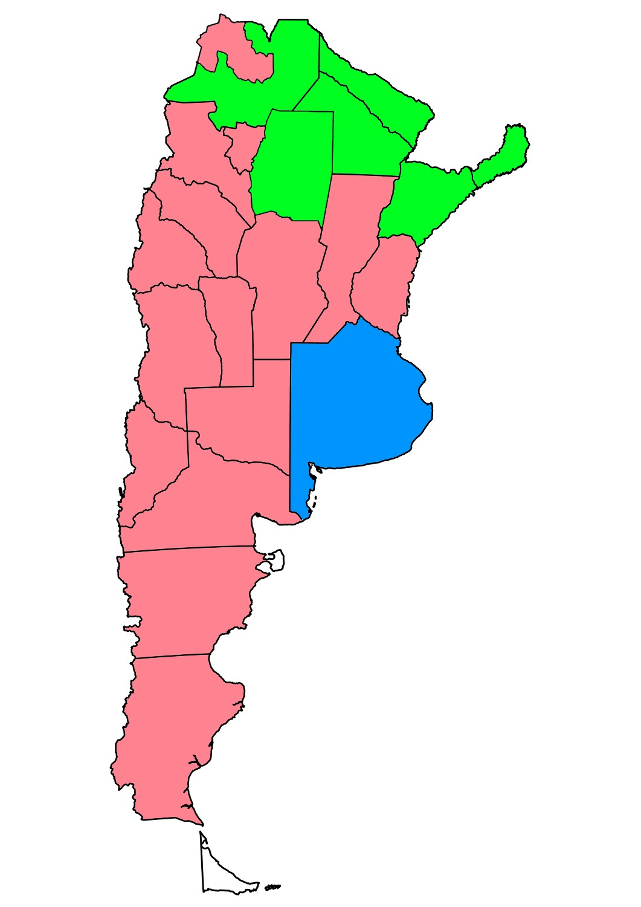

Fuente de los datos:
[Kaggle - Argentina provincial data](https://www.kaggle.com/datasets/kingabzpro/argentina-provincial-data)


```{r setup, include=FALSE}
knitr::opts_chunk$set(echo = TRUE)
```

# CARGA DE BIBLIOTECAS
```{r, message=FALSE, warning=FALSE}
# Importamos las bibliotecas necesarias para el análisis.
library(readr)          
library(dplyr)             
library(FactoMineR)     
library(psych)             
library(factoextra)        
library(corrplot)          
library(PerformanceAnalytics) 
library(ggplot2)            
library(plotly)             
library(philentropy)        
library(viridis)
library(cluster)
library(pheatmap)
library(NbClust)

options(scipen = 6) # para evitar notacion cientifica.

```

# CARGA DE DATOS
```{r, message=FALSE, warning=FALSE}
datos <- read_csv("argentina.csv")

# Eliminamos la columna "provincia" y renombramos las columnas para mayor claridad
datos <- subset(datos, select = -c(1))
colnames(datos) <- c("pbi", "analfabetismo", "pobreza", "infraestructura_deficiente", "abandono_escolar", "falta_atencion_medica", "mortalidad_infantil", "poblacion", "cines_por_cada_habitante", "medicos_por_cada_habitante")
```

# BÚSQUEDA DE DATOS NULOS
```{r, message=FALSE, warning=FALSE}
View(summarise_all(datos, funs(sum(is.na(.)))))
# datos <- na.omit(datos) # Eliminamos las filas con valores nulos en caso de haber
```

# CASTEO DE DATOS
Convertimos todas las columnas a tipo numérico para asegurarnos de que sean interpretables.
```{r, message=FALSE}
attach(datos)
datos <- datos %>% mutate_all(as.numeric)
```

# ANÁLISIS EXPLORATORIO DE DATOS
```{r}
summary(datos)  # Estadísticas descriptivas
```

# BOXPLOT DE LOS DATOS CUANTITATIVOS
Creamos un boxplot para visualizar la distribución de los datos cuantitativos.
```{r}
pbi_boxplot <- plot_ly(y = ~datos$pbi , type = "box")
pbi_boxplot
rm(pbi_boxplot)  # Limpiamos la variable utilizada para el gráfico
```

# ANALISIS DE COMPONENTES PRINCIPALES

# CORRELACIONES PARA JUSTIFICAR EL ACP

Visualización con índice de correlación para cada atributo
```{r}
datos_cor <- cor(datos)  # Calculamos y almacenamos las correlaciones
corrplot(datos_cor, method = "number", tl.col = "black", tl.cex = 0.8)
```

# ES RELEVANTE APLICAR ACP?
Utilizamos el test de Bartlett y el índice KMO para evaluar si es adecuado el ACP.
```{r}
cortest.bartlett(cor(datos), n = 22)  # Test de Bartlett
KMO(cor(datos))                       # Índice KMO
```

# ANÁLISIS DE COMPONENTES PRINCIPALES
```{r}

cp <- prcomp(datos, scale = TRUE)  # Realizamos el ACP
summary(cp)                        # Resumen de los resultados del ACP

# Los elementos center y scale almacenan la media y desviación de las variables originales
cp$center  
cp$scale   

# sdev almacena la desviación de los cp
cp$sdev    

# rotation contiene el valor de los autovalores para cada componente 
cp$rotation  

# x almacena los autovectores
cp$x 
```

# GRÁFICO DE SEDIMENTACIÓN DE LAS COMPONENTES
Visualizamos el gráfico de sedimentación de las componentes.
```{r}
plot(cp, 
     type = "l", 
     main = "Gráfico de sedimentación",
     col = c("blue4"))
```

# SCREEPLOT
Vemos el screeplot para decidir cuantas componentes usar
```{r}
fviz_screeplot(cp, addlabels = TRUE, ylim = c(0, 60),
               main = "CP más significativas con Screeplot")

# AJUSTE DE LA TÉCNICA
scree(cor(datos), pc = TRUE)
```

# BIPLOT
Realizamos un biplot para visualizar las variables y las observaciones en el espacio de componentes principales.
```{r}
biplot(x = cp, scale = 0, cex = 0.6, col = c("blue4", "brown3"))
```

# CLUSTER JERÁRQUICO

# ESCALADO DE DATOS y SELECCIÓN DE MEDIDAS 
```{r}
datos_esc <- scale(datos)
mat_dist <- dist(x = datos_esc, method = "euclidean")  # Optamos medida de distancias Euclidean

hc_euclidea_average  <- hclust(d = mat_dist, method = "average")  # Optamos medida de linkeo avg
cor(x = mat_dist, cophenetic(hc_euclidea_average))
```

# DENDROGRAMA
Visualizamos dendrograma de clustering jerarquico.
```{r, message=FALSE, warning=FALSE}

fviz_dend(x = hc_euclidea_average, k = 3, cex = 0.6) + 
  geom_hline(yintercept = 5.5, linetype = "dashed") +
  labs(title = "Clustering jerárquico",
       subtitle = "Distancia euclidea, Linkage average, k=3")
```

# ASIGNACIÓN DE GRUPOS Y VISUALIZACION
Visualización de grupos en el plano de las 3 primeras componentes
```{r}
cutree(hc_euclidea_average, k = 3)  

fviz_cluster(object = list(data = datos, cluster = cutree(hc_euclidea_average, k = 3)),
             ellipse.type = "convex", repel = TRUE, show.clust.cent = FALSE,
             labelsize = 8)  +
  labs(title = "Clustering jerárquico + Proyección PCA",
       subtitle = "Distancia euclídea, Linkage avg, K=3") +
  theme_bw() +
  theme(legend.position = "bottom")
```

# CLUSTER JERÁRQUICO DIVISIVO
```{r}
hc_diana <- diana(x = mat_dist, diss = TRUE, stand = FALSE)

fviz_dend(x = hc_diana, cex = 0.5) +
  labs(title = "Clustering divisivo",
       subtitle = "Distancia euclídea")
```


# MAPA DE CALOR
```{r}
colores <- viridis(254) 
heatmap(x = datos_esc, scale = "none",col = hcl.colors(50), cexRow = 0.7) 

kn <- 3  # Número de grupos 
pheatmap(mat = datos_esc, scale = "none", clustering_distance_rows = "manhattan",
         clustering_distance_cols = "euclidean", clustering_method = "ward.D2",
         cutree_rows = kn, fontsize = 8)

```

# CLUSTER NO JERÁRQUICO - KMEANS
```{r, message=FALSE, warning=FALSE}
km_clusters_2 <- kmeans(x = mat_dist, centers = 3, nstart = 50)

# NÚMERO ÓPTIMO DE CLUSTERS (usando índice de silueta)
fviz_nbclust(x = datos_esc, FUNcluster = kmeans, method = "silhouette", k.max = 11) +
  labs(title = "Número óptimo de clusters", diss = mat_dist)

set.seed(101)  # Establecemos una semilla para reproducibilidad
fviz_cluster(object = km_clusters_2, data = datos, show.clust.cent = TRUE,
             ellipse.type = "euclid", star.plot = TRUE, repel = TRUE) +
  labs(title = "Resultados clustering K-means con k=3") +
  theme_bw() +
  theme(legend.position = "none")
```

# ANÁLISIS DE SILUETA
```{r}
km_clusters <- eclust(x = datos_esc, FUNcluster = "kmeans", k = 3, seed = 123,
                      hc_metric = "manhattan", nstart = 50, graph = FALSE)

fviz_silhouette(sil.obj = km_clusters, print.summary = TRUE, palette = "jco",
                ggtheme = theme_classic()) 
```

# DISPERSIÓN DE COMPONENTES PRINCIPALES
Creamos un nuevo dataframe que incluya las dos primeras componentes principales y la asignación de clusters
```{r}
df <- data.frame(PC1 = cp$x[, 1], PC2 = cp$x[, 2], Cluster = km_clusters_2$cluster)

# Creamos el diagrama de dispersión
ggplot(df, aes(x = PC1, y = PC2, color = factor(Cluster))) +
  geom_point(size = 3) +
  labs(title = "Diagrama de Dispersión de Componentes Principales",
       x = "Componente Principal 1",
       y = "Componente Principal 2") +
  scale_color_discrete(name = "Cluster") +
  theme_minimal()
```

# MAPA DE ARGENTINA MOSTRANDO LOS CLUSTERS


# CONCLUSIÓN
<p style="font-size: 25px; margin-bottom: 80px;">
Estos resultados proporcionan una visión más profunda de la heterogeneidad provincial en Argentina. El ACP ha simplificado la complejidad de los datos al identificar las dimensiones clave, mientras que el clustering ha revelado patrones de agrupación significativos. Esta información es fundamental para la formulación de políticas y la asignación de recursos, ya que destaca las áreas que requieren una atención específica y permite una comprensión más precisa de la diversidad regional en el país.
</p>
